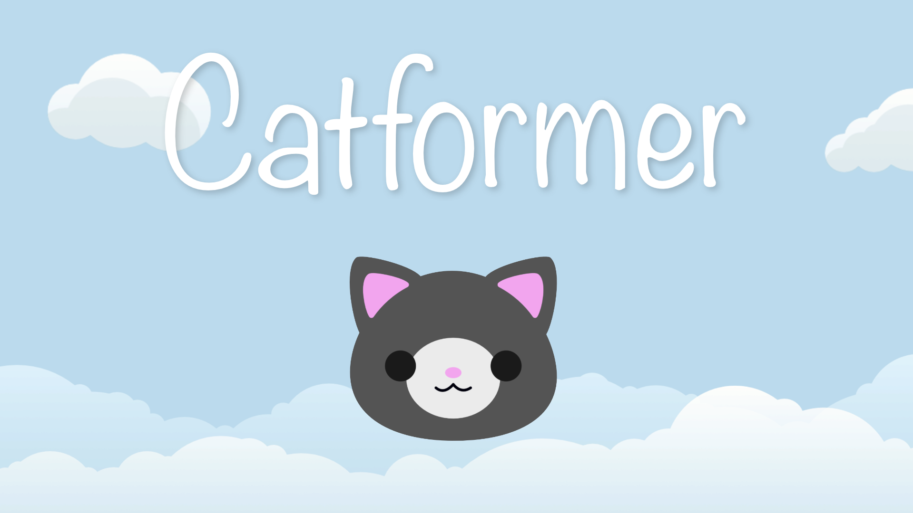
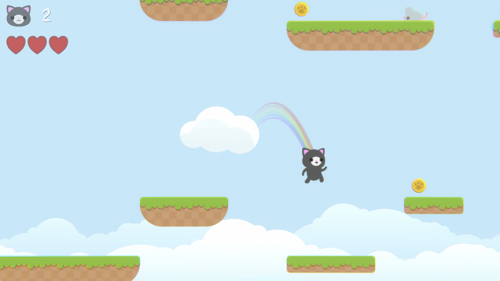

# Catformer

## Table of contents

- [Introduction](#overview)
  - [Screenshot](#screenshot)
  - [Links](#links)
  - [Built with](#built-with)

## Introduction
This is a simple platformer game made in Unity utilizing various scripts for movement, enemies, damage, lives, parallax backgrounds.

### Screenshot

### Links

- [Itch.io Page](https://ouchmousestudio.itch.io/catformer/)

### Built with

* Unity
* C#

## Credits
* Game made by Miles Fearnall-Williams
* Music, level and character design - Miles
